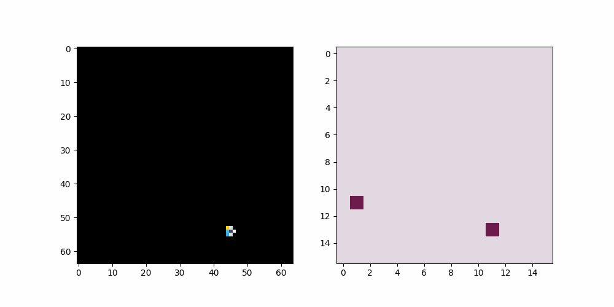
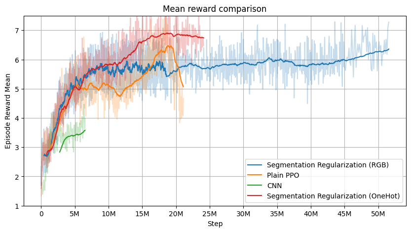
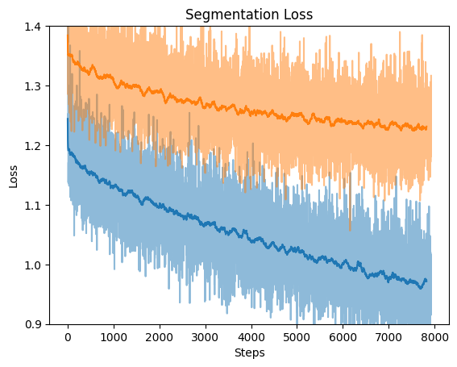
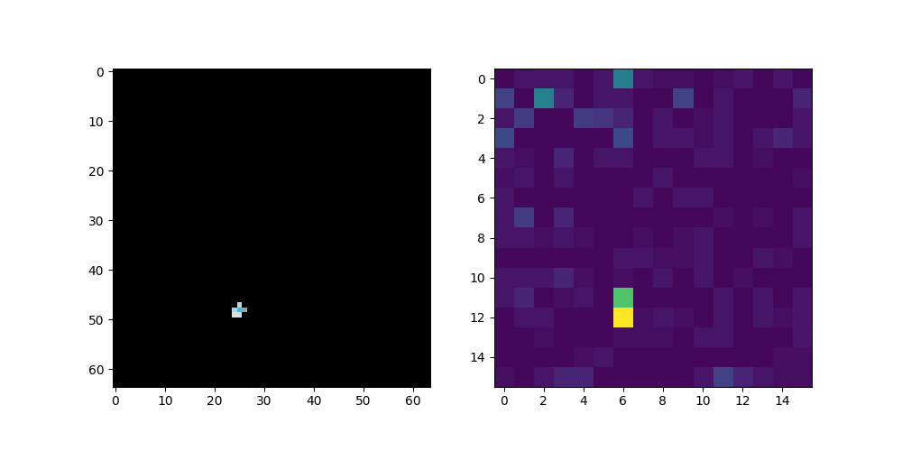

# Explainable Vision Reinforcement Learning with PPO and Vision Transformers

This repository contains the implementation and results of a thesis project focused on enhancing the explainability of reinforcement learning (RL) agents using vision-based observations. 
The project investigates the use of Proximal Policy Optimization (PPO) combined with Vision Transformers (ViTs) and proposes novel methods for improving model interpretability.

 Our analysis reveals a significant improvement, with a 41% lower in mean squared error (MSE) loss between segmentation and embeddings correlation.  
 Furthermore, agent behavior interpretability is analyzed using tools such as decision trees. 
 Experimental results demonstrate that the proposed methods significantly enhance both the explainability of the models and the stability of the training process.
 



# Core ideas
* Explainability in RL: Methods for interpreting the decisions made by RL agents, particularly those using vision-based observations.
* PPO with Segmentation Regularization: A modified PPO algorithm that incorporates segmentation-based regularization to improve model interpretability.
* Vision Transformers (ViTs): The use of ViTs as feature extractors for RL agents, leveraging their attention mechanisms for explainability.
* Comparison with CNNs: A comparative study between Convolutional Neural Networks (CNNs) and ViTs in terms of performance and interpretability.
* Explaining behavior with decision trees: Using generated and explicit segmentation mask I built small and interpretable decision trees.

# Results
Using enviroments from [procgen](https://github.com/openai/procgen) benchmark we trained few architecures using modifed PPO algorithm. The results are in par with native PPO and sometimes can even surpass the original. 
The experiments demonstrate the effectiveness of the proposed methods:
* Improved Explainability: The use of segmentation-based regularization and attention mechanisms significantly enhances the interpretability of the agent's decisions.
* Stability: The modified PPO algorithm have simillar stability compared to original algorithm.








# Reproduction

All logs, scripts and some models required to run experiments are in this repository.

## Install dependecies

You should create conda enviroment from `enviroment.yml` file. To compile and run custom procgen env follow the instructions in original repo of the benchmark.

## Run experiments

You can run any script from src folder. Scripts starting with `train_*` are training scripts. Example usage
```
python train_network_baseline.py
python train_network_baseline.py --resume ./path/to/resumed/model
```
## Track training
```
tensorboard --logdir ./logs
```

